# Personal Dictionary｜个人词典

一款以**词义辨析**为核心、会沿着个人学习经历持续生长的本地优先桌面词典。

它不只回答“这个词翻译成什么”，而是继续回答：几个相近表达究竟差在哪里、分别适合什么语境、怎样用于写作，以及它们如何与已经学过的词建立联系。

> 当前界面展示：Windows 开发版 `v0.5.8`
> 本仓库用于产品与工程能力展示，不公开完整商业核心源码、提示词、真实用户数据、API 密钥和备份。

**导师快速入口：** [3–5 分钟了解项目](README_FOR_MENTOR.md) · [下载 Windows 版本](https://github.com/littlelaurence666/personal-dictionary-desktop/releases/latest) · [架构说明](docs/ARCHITECTURE.md) · [产品复盘](docs/PRODUCT_CASE_STUDY.md)

## 不安装，也能看懂完整产品

### 1. 完整词汇工作台

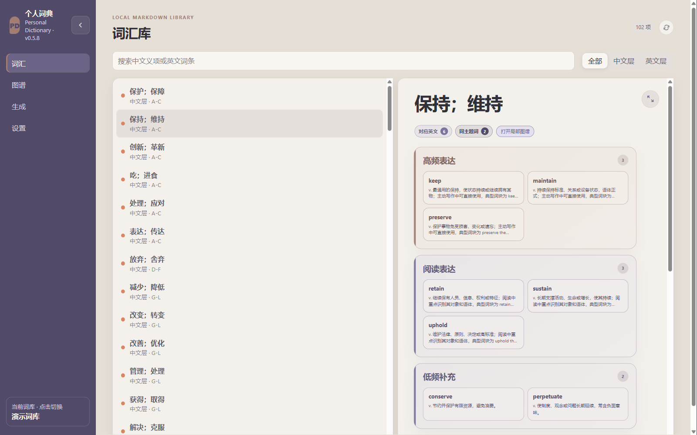

左侧导航贯穿整个软件：**词汇**用于结构化复习，**图谱**用于探索多种语义关系，**生成**用于创建个人化词条，**设置**集中管理模型、关系、外部接入与备份。主区域展示当前词条的分层表达、关系入口和辨析内容。

### 2. 核心亮点：把相近词放在一起辨析

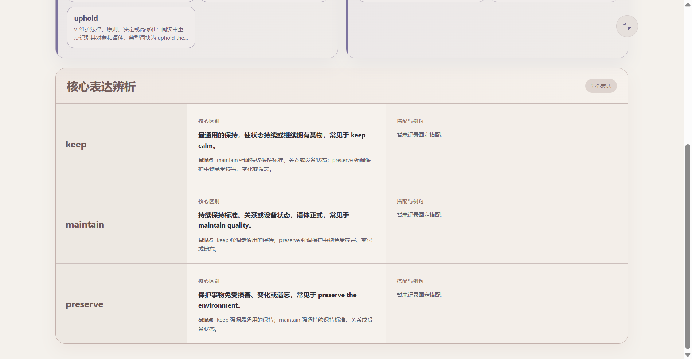

`keep`、`maintain` 和 `preserve` 都可能被译为“保持”，但对象、语体、搭配和使用目的并不相同。软件把同一中文意项下的核心表达放进同一张辨析表，而不是拆成互不相干的单词卡。

### 3. 个人化词典如何生成

输入自己在阅读、课程、写作或交流中真正遇到的词。生成在后台进行，不会立刻改动词库。

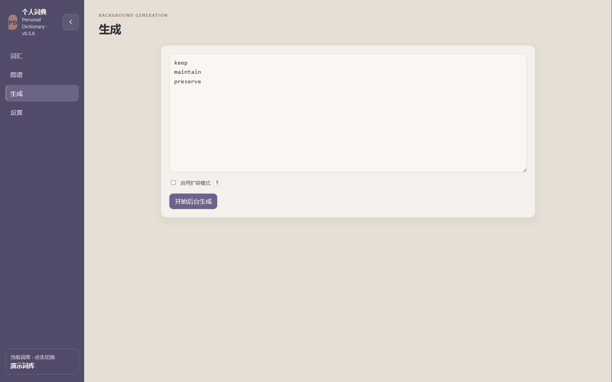

AI 生成结构化义项、搭配、例句与辨析后，软件把新结果和已有词条放在一起审阅；用户确认保留、覆盖或新增后，本地核心才执行写入。

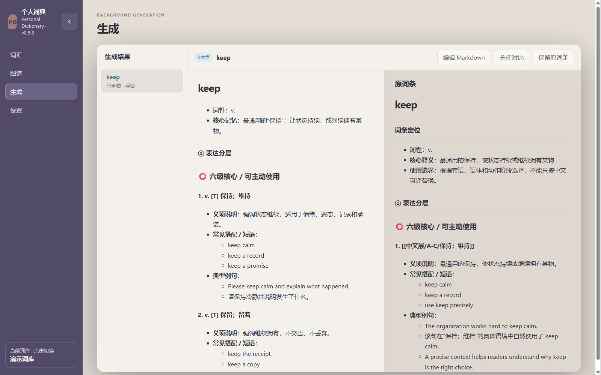

**完整闭环：** 遇到新词 → 后台 AI 生成 → 结构校验 → 新旧内容对比 → 人工确认 → 写入个人 Markdown 词库。

### 4. 多关系知识图谱

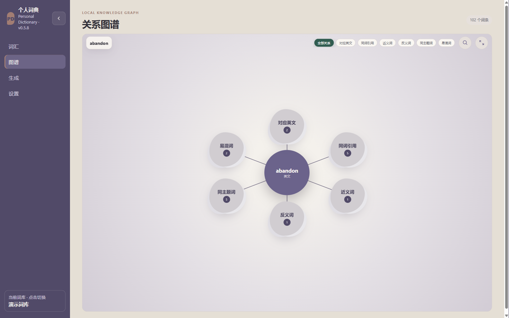

图谱不是静态装饰。用户可以拖动节点、展开关系云团、按关系筛选，并点击关联词切换新的中心。词族、近义、反义、同主题、易混和中英对应等关系共同组成一个可探索的局部知识网络。

### 5. 设置与扩展能力

设置采用分类导航，不需要在一个超长页面里寻找功能。当前包含：**主题、AI 服务、关系类别、手动连词、AI 扩充、学习接入、备份**。

#### 主题与 AI 服务

| 主题系统 | AI 服务 |
| --- | --- |
| 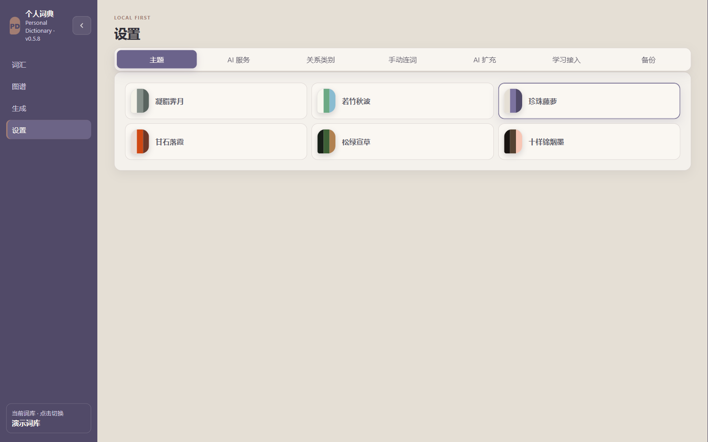 | 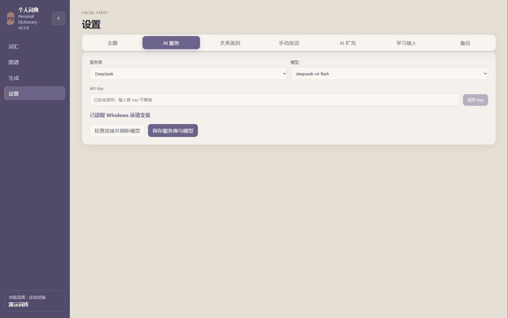 |

#### 三种关系管理方式

| 关系类别 | 手动连词 |
| --- | --- |
| 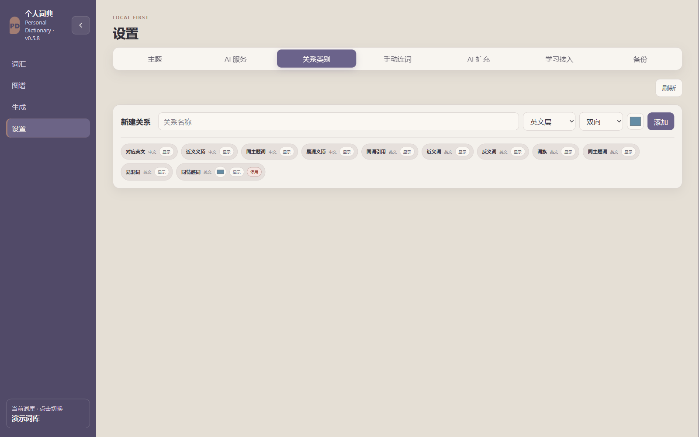 | 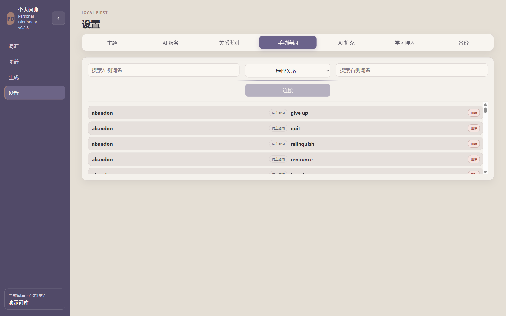 |

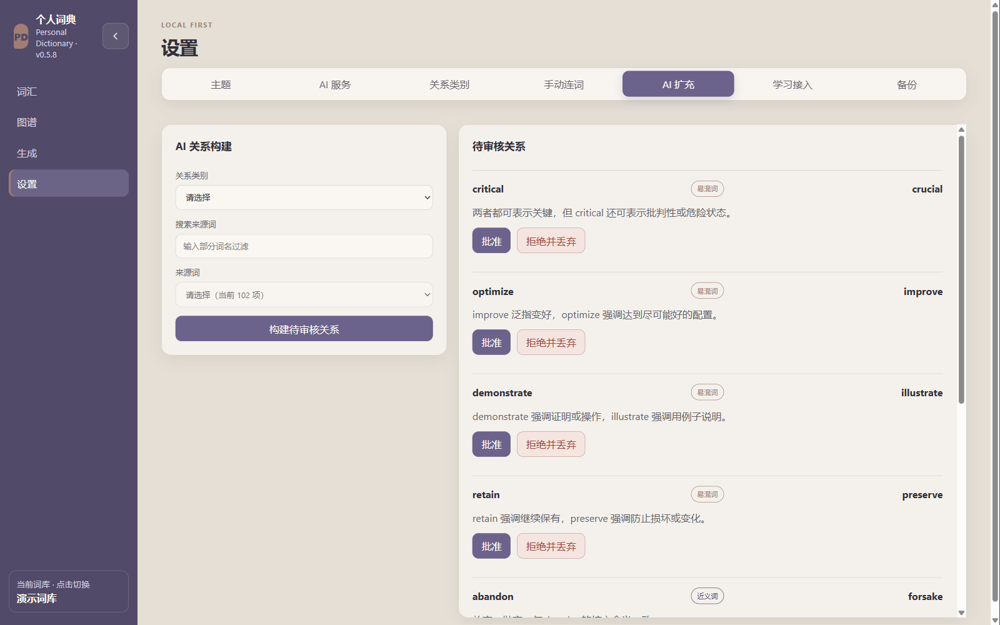

#### 外部学习接入与本地备份

| 学习接入 | 备份与恢复 |
| --- | --- |
| 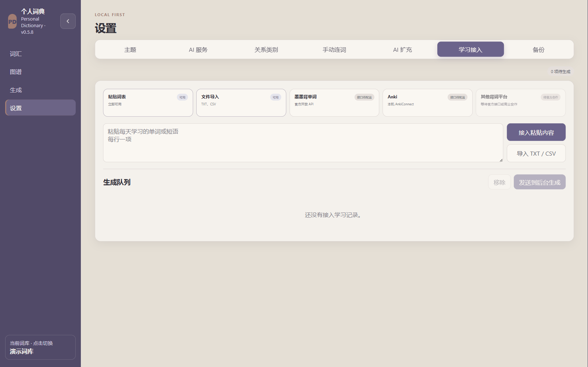 | 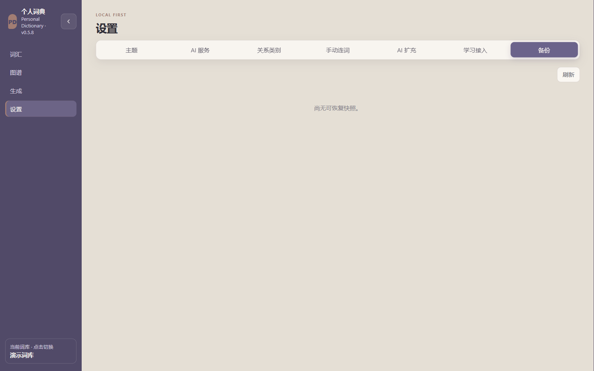 |

## 为什么做这个产品

经典背词平台擅长记忆单词和中英翻译，却很难回答更进一步的问题：`keep`、`maintain` 和 `preserve` 都能译作“保持”，真正写作时应该选哪一个？它们对对象、语气、搭配和语境的要求有什么差别？

这种细微差别直接影响四六级翻译与作文的用词严谨性，也影响出国交流、外刊与书籍阅读，以及对外语文化和语境的理解。语言学习不能一直停留在一组中英释义上。

Personal Dictionary 把“寻找细微差别”的整理工作交给 AI，但把最终判断留给用户：

- 用户遇到一个词，AI 才围绕这个词生成义项层次、辨析、搭配、例句与关系候选。
- 多个相近表达会被放进同一张辨析表中比较。
- 新结果必须经过结构校验和人工审阅，不能直接写入词库。
- 被确认的词通过多种关系进入局部知识图谱。

最终得到的不是一部陌生、固定的通用词典，而是一份能够体现个人外语接触路径与知识生成过程的**个人词典**。

## 我的角色与 AI 协作

我负责提出问题、定义产品目标、规划信息架构和交互规则，并完成关键技术选择、迭代验收与最终交付；同时把生成式 AI 用于需求推演、原型迭代、代码协作、测试排查和内容生成。

AI 既是产品中的内容生成能力，也是开发过程中的协作工具。产品判断、数据安全边界和最终取舍由我负责，模型输出必须进入可校验、可审阅、可恢复的产品闭环。

## 核心能力

- **结构化词义辨析：** 比较核心区别、易混点、典型搭配与例句，解释“为什么这里用它”。
- **个人化 AI 生成：** 根据用户真正遇到的新词生成内容，而不是预装一部固定词典。
- **审阅后写入：** 同时查看新内容和旧词条，逐条决定新增、保留或覆盖。
- **多关系图谱：** 以当前词为中心探索多类联系，支持筛选、展开、拖动和中心切换。
- **本地优先：** Markdown 作为数据源，Python 核心统一负责校验、写入、索引、备份和恢复。
- **学习接入：** 支持粘贴词表和 TXT/CSV，并为 Anki 及其他学习平台预留适配器边界。
- **多模型适配：** 将不同模型服务收敛为统一生成协议，密钥只从用户本地配置读取。

## 产品与数据流程

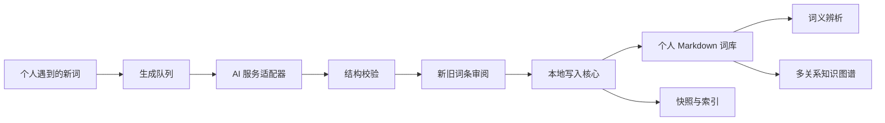

## 技术架构

| 层级 | 技术 | 主要职责 |
| --- | --- | --- |
| 桌面端 | Electron | Windows 桌面壳、窗口与发布 |
| 界面 | React + TypeScript + Vite | 词库、图谱、生成审阅、设置与新手指南 |
| 本地核心 | Python 3.11 | 解析、校验、索引、快照、导入与恢复 |
| 数据 | Markdown + JSON 索引 | 可读、可迁移的个人词库与关系数据 |
| 质量 | Vitest + Python tests | UI 合同、关系逻辑、导入、备份与恢复验证 |
| 打包 | PyInstaller + Electron Forge | Python sidecar 与 Windows 安装/免安装版本 |

## 关键工程决策

1. **AI 不拥有写入权。** 模型只产出候选结果，本地校验与人工审阅后才允许修改词库。
2. **只有 Python 核心写入数据。** 避免前端、插件和零散脚本各自写文件造成规则漂移。
3. **图谱采用局部探索。** 围绕当前词逐层展开，避免巨大而嘈杂的全局图。
4. **关系类别与主题颜色解耦。** 类别依靠名称和筛选识别，避免关系增多后视觉失控。
5. **失败必须可恢复。** 写入和恢复均围绕快照、索引重建与校验设计。

## 当前工程状态

- 桌面端 `46` 项自动化测试通过。
- React / TypeScript / Electron 正式构建通过。
- Windows 安装版与免安装版均已完成打包。
- 已实现中文层与英文层复习、局部图谱、后台生成、人工审阅、多主题、新手指南、学习接入和备份恢复。

具体验证边界见 [工程验证说明](docs/ENGINEERING_EVIDENCE.md)。

## 路线图

- [x] Markdown 词库导入、索引、备份与恢复
- [x] 中文层 / 英文层结构化复习界面
- [x] 局部多关系图谱与关系筛选
- [x] AI 后台生成与逐条审阅
- [x] 多主题与首次使用指南
- [x] Windows 安装版与免安装版
- [ ] 更多学习平台的正式授权适配
- [ ] 跨设备同步与账户体系
- [ ] macOS 版本与可访问性完善

## 展示与授权

本仓库用于作品集展示，不提供完整商业核心源码，也不授予复制、再分发或商业使用许可。截图使用内置演示词库；真实用户数据、API 密钥、AI 临时任务和备份不会进入仓库。
