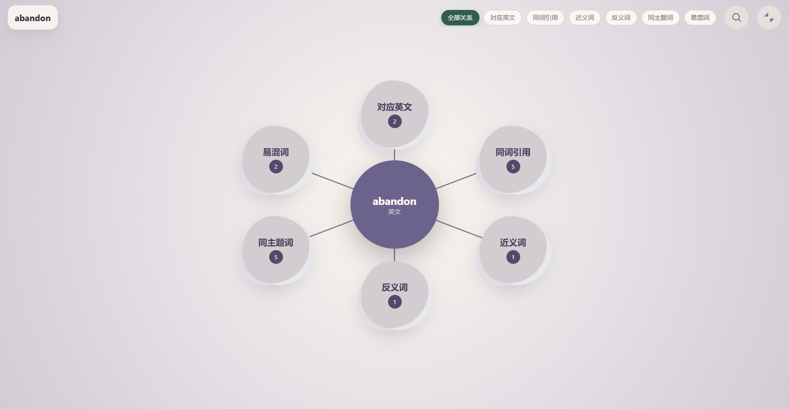
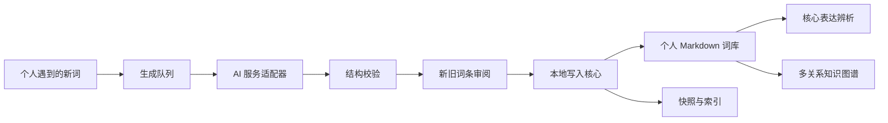

# Personal Dictionary｜个人词典

一款围绕**词义辨析**构建的本地优先桌面软件。它不满足于给出“英文—中文”的简单对应，而是帮助用户比较近义表达之间的语义边界、语域、搭配和使用场景；再由 AI 根据用户实际遇到的词生成内容，让词典随着个人的阅读、写作与交流经历持续生长。

> 当前展示版本：Windows `v0.5.7`
> 仓库定位：产品与工程能力展示。为保护用户数据和后续商业化，本仓库不公开完整核心源码、提示词、真实词库、密钥或备份。

[下载最新 Windows 版本](https://github.com/littlelaurence666/personal-dictionary-desktop/releases/latest)

## 细微词义辨析

## 个人多关系知识图谱

## 为什么做这个产品

许多经典背词平台擅长记忆单词和中英翻译，却很难回答更进一步的问题：`keep`、`maintain` 和 `preserve` 都能译作“保持”，真正写作时应该选哪一个？它们对对象、语气、搭配和语境的要求有什么差别？

这种细微差别直接影响四六级翻译与作文的用词严谨性，也影响出国交流、外刊阅读、书籍阅读以及对外语文化和语境的理解。语言学习不能永远停留在一组中英释义上。

Personal Dictionary 因此把“寻找细微差别”的整理工作交给 AI，但把最终判断留给用户：

- 用户遇到一个词，AI 才围绕这个词生成义项层次、辨析、搭配、例句与关系候选。
- 多个相近表达会被放进同一张辨析表中比较，而不是各自成为互不相干的单词卡。
- 已确认的词通过近义、反义、词族、同主题、易混和中英对应等关系形成局部知识图谱。
- 新结果先与原词条对比，逐条审阅确认后才写入本地词库。

最终得到的不是一部陌生、固定的通用词典，而是一份能体现个人外语接触路径与知识生成过程的**个人词典**。

## 项目角色与 AI 协作

本项目由我提出问题、定义产品目标、规划信息架构与交互规则，并负责关键技术选择、迭代验收和最终交付；在此基础上使用生成式 AI 协作完成需求推演、界面原型、代码实现、内容生成和测试排查。AI 既是产品中的内容生成能力，也是开发过程中的协作工具，但产品判断、数据安全边界和最终取舍由我负责。

## 核心功能

### 1. 核心表达辨析

- 在同一中文意项下同时比较全部核心英文表达，而不是只解释其中一个词。
- 对每个表达呈现核心区别、易混点、典型搭配与例句，突出“为什么这里用它而不用另一个”。
- 高频、阅读和低频分层用于安排复习顺序，核心辨析才是产品的学习中心。

### 2. 多关系知识图谱

- 以当前词为中心，展示词族、近义、反义、同主题、中英对应和易混等关系云团。
- 支持关系筛选、拖拽反馈、展开关系和切换中心词。
- 从词汇页点击关系标签会进入独立图谱页面，并自动保留对应滤镜。

### 3. 按个人经历生长的 AI 词典

- 支持多家模型服务配置；用户遇到的新词可进入后台生成队列。
- AI 根据当前词与已有词库生成结构化内容和关系候选，使词典沿个人学习路径生长。
- 生成结果不会直接写入词库；用户可以逐条查看新增、保留或覆盖内容。
- 审阅界面同时展示 AI 结果和原词条，最终确认后才由本地核心执行写入。
- 导入前自动校验结构，写入前创建快照，失败时保留可追踪报告。

### 4. 本地优先与可恢复

- Markdown 是数据源，桌面端不锁定用户内容。
- Python 核心统一负责词库写入、索引、备份和恢复。
- Electron 渲染层通过受限 IPC 调用本地能力，页面不直接操作任意文件。
- 支持最近快照恢复，并在恢复前再次保存当前状态。

### 5. 学习接入平台

- 支持粘贴词表与 TXT/CSV 导入。
- 预留 Anki、墨墨背单词及其他学习平台的适配器边界。
- 外部来源先进入生成队列，再复用同一套审阅与写入流程。

## 产品结构

更详细的边界与数据流见 [架构说明](docs/ARCHITECTURE.md)。

## 技术栈

| 层级 | 技术 | 主要职责 |
| --- | --- | --- |
| 桌面端 | Electron | Windows 桌面壳、窗口与发布 |
| 界面 | React + TypeScript + Vite | 词库、图谱、审阅、设置与新手指南 |
| 本地核心 | Python 3.11 | 解析、校验、索引、快照、导入与恢复 |
| 数据 | Markdown + JSON 索引 | 可读、可迁移的本地词库 |
| 质量 | Vitest + Python tests | UI 合同、关系逻辑、导入与恢复验证 |
| 打包 | PyInstaller + Electron Forge | Python sidecar 与 Windows 安装/免安装版本 |

## 关键工程决策

1. **AI 不拥有写入权。** 模型只产出候选结果，本地校验与人工审阅完成后才允许修改词库。
2. **只有 Python 核心写入数据。** 避免前端、插件和脚本各自修改文件造成规则漂移。
3. **图谱采用局部探索。** 不在首版渲染巨大而嘈杂的全局图，而是围绕当前词逐层展开。
4. **关系类别与颜色解耦。** 主题决定视觉基调，关系依靠名称与筛选识别，避免类别增多后页面失控。
5. **失败必须可恢复。** 写入与恢复均围绕快照、索引重建和校验设计。

## 质量状态

- 桌面端：`46` 项自动化测试通过。
- Python 核心：`111` 项自动化测试通过。
- React/TypeScript 与 Electron 构建通过。
- Windows 安装版和免安装版均已完成打包。
- 当前版本：`0.5.7`。

具体验证边界见 [工程验证说明](docs/ENGINEERING_EVIDENCE.md)。

## 项目复盘

这个项目覆盖了从问题发现、产品规划、信息架构、交互原型、AI 协作开发、数据协议到桌面交付的完整过程。重点不只是“调用一次 AI”，而是用 AI 降低深度辨析和个人知识整理的成本，并将模型的不确定性放进一个可校验、可审阅、可恢复的产品闭环。完整的产品思考与取舍见 [产品案例复盘](docs/PRODUCT_CASE_STUDY.md)。

## 路线图

- [x] Markdown 词库导入、索引、备份与恢复
- [x] 中文层 / 英文层结构化复习界面
- [x] 局部多关系图谱与关系筛选
- [x] AI 后台生成与逐条审阅
- [x] 多主题与首次使用指南
- [x] Windows 安装版与免安装版
- [ ] 更多学习平台的正式授权适配
- [ ] 跨设备同步与账户体系
- [ ] macOS 版本与可访问性完善

## 展示与授权

本仓库用于作品集展示，不提供完整商业核心源码，也不授予复制、再分发或商业使用许可。演示数据均为脱敏样例；真实用户数据、API 密钥、AI 临时任务和备份不会进入仓库。
