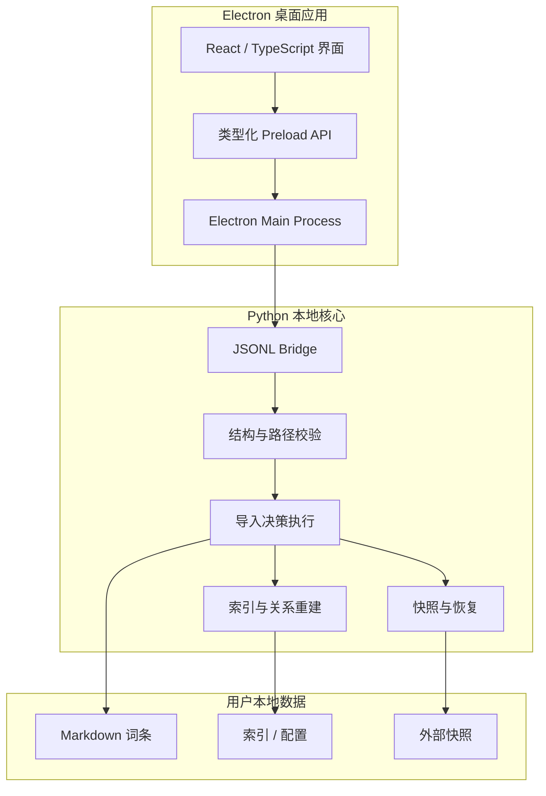

# 架构说明

## 目标

Personal Dictionary 的核心约束是：AI 可以生成候选内容，但不能绕过校验和人工审阅直接修改用户词库；桌面界面可以发起操作，但不能成为第二个数据写入者。

## 分层

## 一次 AI 生成的完整路径

1. 用户输入单词或从外部学习来源加入队列。
2. 桌面端读取当前服务商与模型设置，创建后台任务。
3. 模型返回结构化候选内容；结果先写入隔离的临时任务区。
4. Python 按中文层、英文层、关系类别和字段白名单校验。
5. 审阅界面展示新内容与原词条，用户逐条选择新增、保留或覆盖。
6. 最终确认后，Python 创建恢复快照并执行写入。
7. 写入完成后重建索引与关系图；失败则保留报告并可恢复。

## 安全边界

- `contextIsolation` 开启，渲染层不直接访问 Node.js。
- IPC 只暴露明确允许的方法，文件路径必须限制在当前词库根目录。
- 子进程使用参数数组启动，不通过 shell 拼接用户输入。
- API 密钥只从本地安全配置或环境读取，不写进词库和展示仓库。
- 真实词库、临时任务、备份与用户路径不会进入公开版本控制。

## 为什么保留 Markdown

- 用户可以直接阅读、备份或迁移数据。
- 即使桌面应用停止维护，词条仍然可用。
- 可以与 Obsidian 等知识管理工具并存，但不依赖它才能运行。
- JSON 索引是可重建的加速层，而不是唯一数据源。
